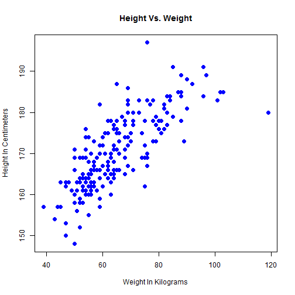
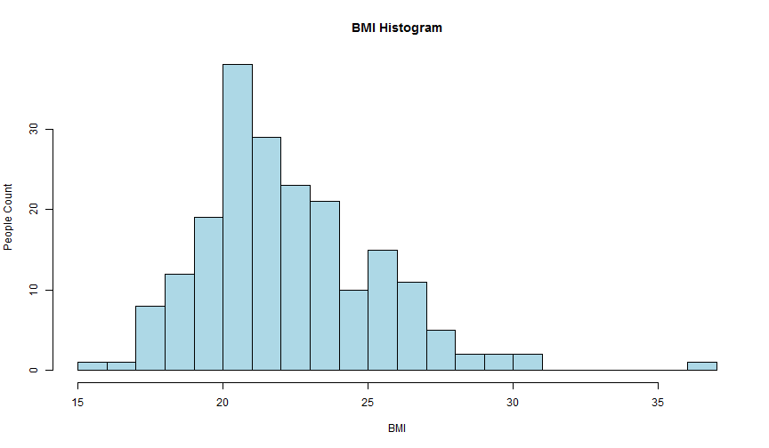

## Overview

1. What Is Body Mass Index?
2. BMI Categories
3. Height & Weight Statistics
4. BMI Statistics
5. References

---

## What Is Body Mass Index?

- The <b>body mass index (BMI)</b>, or <b>Quetelet index</b>, is a measure of relative weight based on an individual's mass and height.

- Devised between 1830 and 1850 by the Belgian polymath Adolphe Quetelet during the course of developing "social physics", it is defined as the individual's body mass divided by the square of their height - with the value universally being given in units of kg/m2.

- Body Mass Index is defined as: 
$$\mathrm{BMI} = \frac{\text{mass}(\text{kg})}{\left(\text{height}(\text{m})\right)^2} = \frac{\text{mass}(\text{lb})}{\left(\text{height}(\text{in})\right)^2}\times 703$$

---

## BMI Categories

- A frequent use of the BMI is to assess how much an individual's body weight departs from what is normal or desirable for a person of his or her height.

- These ranges of BMI values are valid only as statistical categories:

Category                              | BMI range
--------------------------------------|-------------------
Very severely underweight             | less than 15
Severely underweight                  | from 15.0 to 16.0
Underweight                           | from 16.0 to 18.5
Normal (healthy weight)               | from 18.5 to 25
Overweight                            | from 25 to 30
Obese Class I (Moderately obese)      | from 30 to 35
Obese Class II (Severely obese)       | from 35 to 40
Obese Class III (Very severely obese) | over 40

---

## Height & Weight Statistics

- Scatter plot of height versus weight statistics from dataset:

---

## BMI Statistics

- BMI histogram statistics from dataset:

---

## References

1. <b>Wikipedia:</b> http://en.wikipedia.org/wiki/Body_mass_index
2. <b>Application:</b> http://minaasham.shinyapps.io/BodyMassIndex
